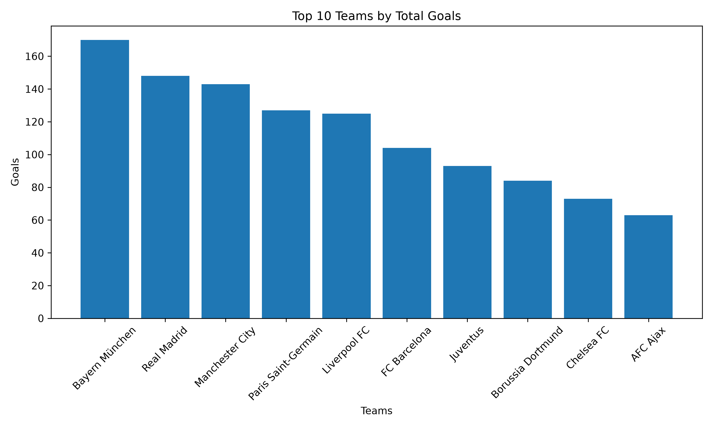
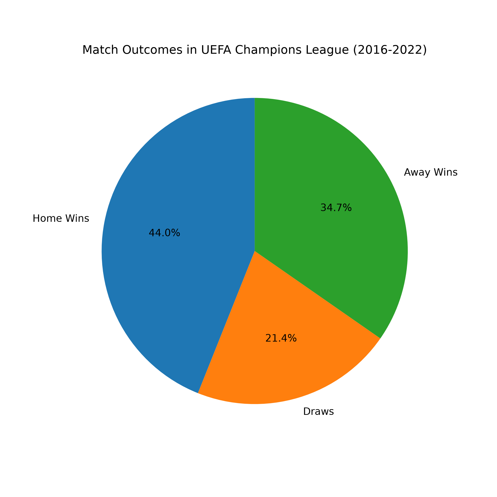
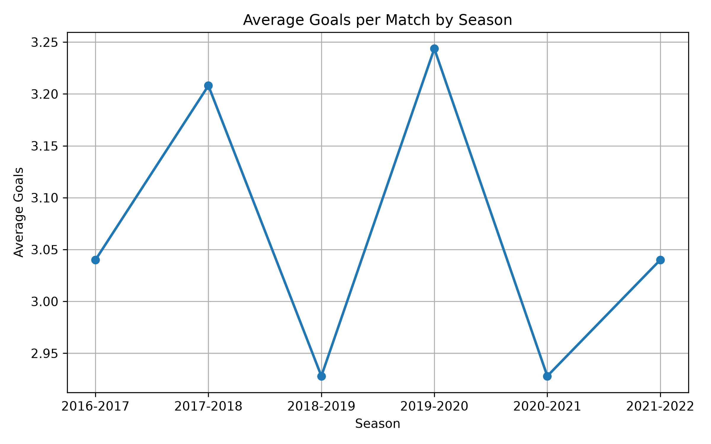
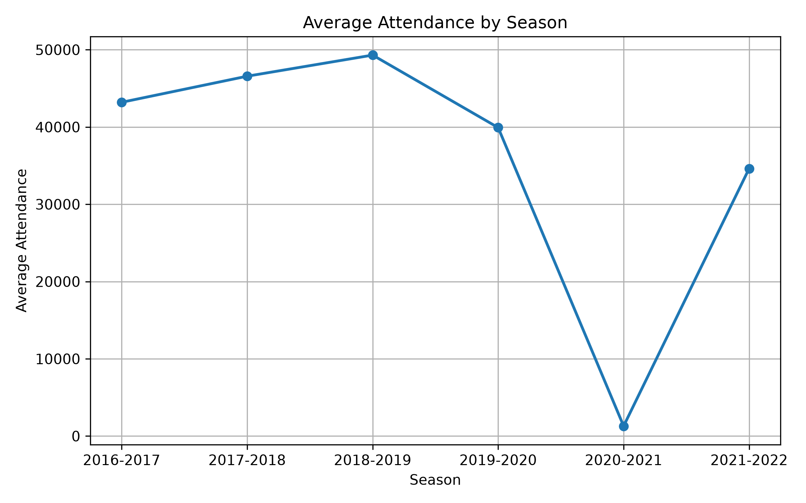
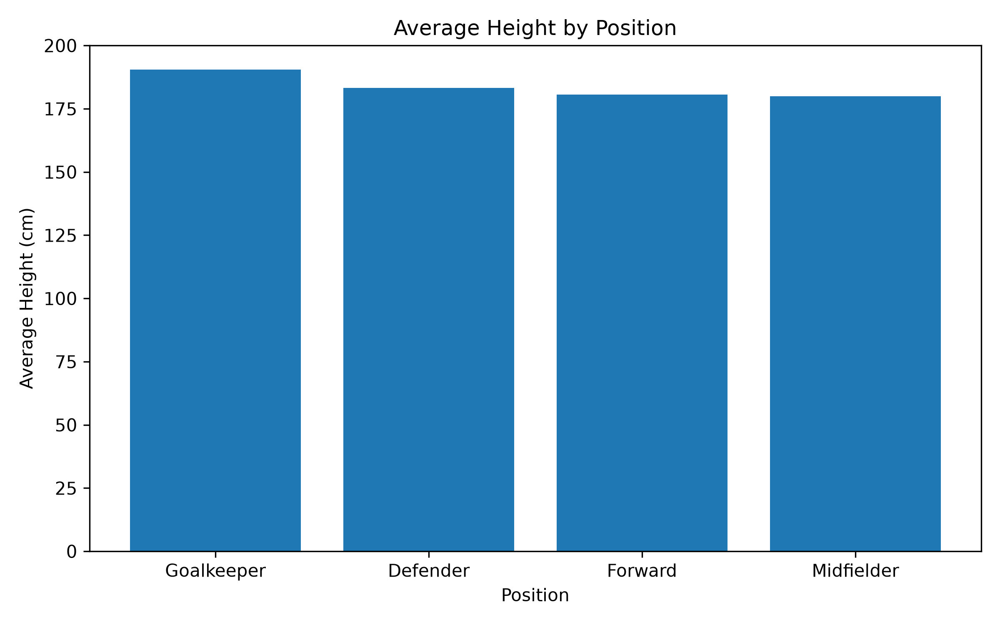
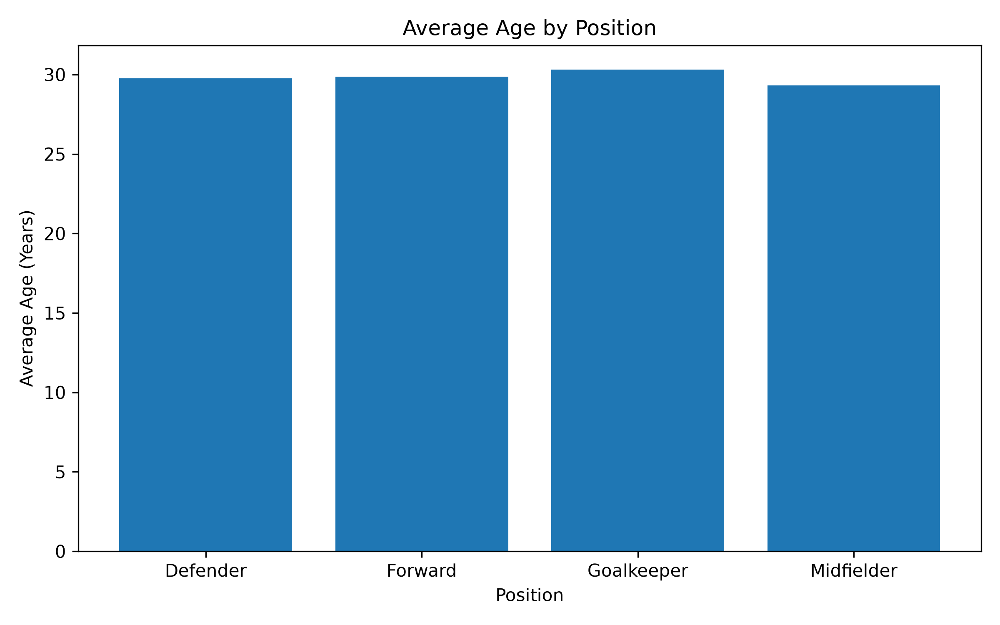

# UEFA Champions League Data Analysis ⚽

A data analysis project exploring UEFA Champions League matches and player statistics using **Python**, **Pandas**, and **Matplotlib**.

## Project Overview

This project analyzes UEFA Champions League data from multiple perspectives, including:

* Goals scored throughout the tournament
* Team performance
* Home advantage
* Match attendance
* Season statistics
* Player height and age analysis

The objective is to practice data analysis, data visualization, and project organization with Python.

---

## Technologies Used

* Python
* Pandas
* Matplotlib
* OpenPyXL
* Git & GitHub

---

## Project Structure

```text
ChampionsLeagueAnalysis/
│
├── data/
│   └── ChampionsLeague/
│       └── ucl_data.xlsx
│
├── images/
│   ├── top_10_teams_by_goals.png
│   ├── home_advantage_pie.png
│   ├── top_attendance_matches.png
│   ├── average_goals_by_season.png
│   ├── average_attendance_by_season.png
│   ├── average_height_by_position.png
│   └── average_age_by_position.png
│
├── src/
│   ├── analysis.py
│   ├── load_data.py
│   └── visualization.py
│
├── main.py
└── README.md
```

---

## Analyses Performed

### Goal Analysis

* Total goals scored
* Average goals per match
* Top 10 scoring teams
* Teams with the most goals conceded

### Home Advantage Analysis

* Home wins
* Away wins
* Draws
* Match outcome distribution

### Attendance Analysis

* Average attendance
* Top 10 highest-attended matches
* Average attendance by season

### Season Analysis

* Total goals by season
* Matches played each season
* Average goals per match by season

### Player Analysis

#### Height

* Average player height
* Top 10 tallest players
* Average height by position

#### Age

* Average player age
* Average age by position

---

## Visualizations

### Top 10 Teams by Goals



---

### Home Advantage



---

### Top 10 Highest Attendance Matches


---

### Average Goals by Season



---

### Average Attendance by Season



---

### Average Height by Position



---

### Average Age by Position



The project includes several visualizations generated with Matplotlib:

* Top 10 Teams by Goals
* Home Advantage Pie Chart
* Top Attendance Matches
* Average Goals by Season
* Average Attendance by Season
* Average Height by Position
* Average Age by Position

---

## How to Run

Clone the repository:

```bash
git clone https://github.com/atasamiloglu/ChampionsLeagueAnalysis.git
```

Install the required packages:

```bash
pip install pandas matplotlib openpyxl
```

Run the project:

```bash
python main.py
```

---

## Learning Outcomes

Through this project, I practiced:

* Data cleaning
* Exploratory Data Analysis (EDA)
* Data visualization
* Modular Python programming
* Git & GitHub workflow
* Working with Excel datasets
* Statistical analysis using Pandas

---

## Author

Created by **Ata** as part of a personal data analysis portfolio project.
